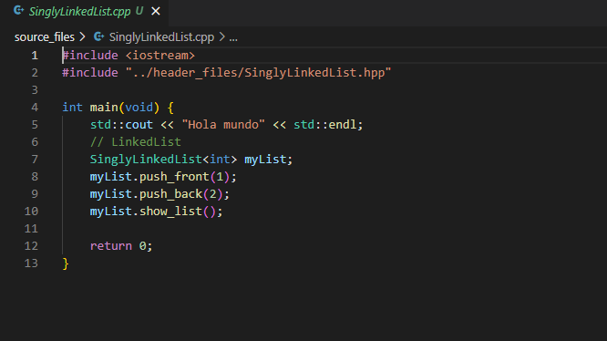

# Data structures and algorithms

## Table of Contents

- [About](#about)
- [Getting Started](#getting_started)

## About <a name = "about"></a>

This repository is used to storage my implementations of data structures and algorithms that I have learned in school and courses.  
- I hope this information is useful for you, and you are allowed to clone this repo, and use this code as you wish. 
- I am not responsible of a bad use of this code.

## Current Data structures and algorithms implementations  

- Singly Linked List

#### [See the header files](./header_files)
## Getting Started <a name = "getting_started"></a>


### Prerequisites

- C++ compiler (i.e. g++)
- Text editor (i.e. Visual Studio Code, ViM, Sublime text)  

### See the data structure or algorithm implementation

If you want to see the implementation of the data structure or algorithm, you just
need to open the header file in your text editor. The header files are in the directory named "header_files".

Header file example:
```
SinglyLinkedList.hpp
```


### Use the data structure or algorithm  

If you want to see or modify the main function where the algorithm or data structure is used, you just need to open the source file of the data structure or algorithm in your text editor.  
The main files are in the directory named "source_files".  

```
SinglyLinkedList.cpp
```


### Compile and run the program
- Commands to compile the programs:
    - GNU/Linux and MacOS
    ```
    cd ./source_file/
    g++ -o executableName ./sourceFile.cpp
    ```
    ")

    - Windows
    ```
    cd .\source_file\
    g++ -o executableName .\sourceFile.cpp
    ```
    ")

- Running command:
    - GNU/Linux and MacOS
    ```
    ./executableName
    ```
    ")  
    - Windows  
    ```
    .\executableName
    ```
    ")


