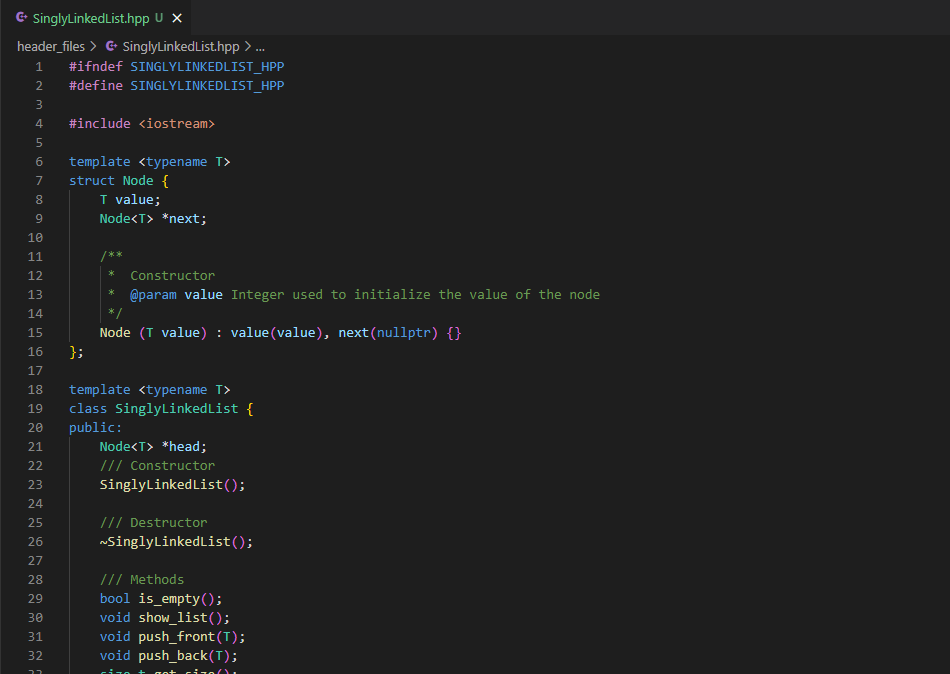

# Data structures and algorithms

## Table of Contents

- [About](#about)
- [Getting Started](#getting_started)

## About <a name = "about"></a>

This repository is used to storage my implementations of data structures and algorithms that I have learned in school and courses.  
- I hope this information is useful for you, and you are allowed to clone this repo, and use this code as you wish. 
- I am not responsible of a bad use of this code.

## Current Data structures and algorithms implementations

- [Singly Linked List](./singly_linked_list)

## Getting Started <a name = "getting_started"></a>


### Prerequisites

- C++ compiler (i.e. g++)
- Text editor (i.e. Visual Studio Code, ViM, Sublime text)  

### See the data structure or algorithm implementation

If you want to see the implementation of the data structure or algorithm, you just
need to open the header file in your text editor.  
Header file example:
```
SinglyLinkedList.h
```


### Use the data structure or algorithm  

If you want to choose which methods of a data structure to use or use a specific algorithm, you just need to open the main file in you text editor, and modify it to add the data structure or algorithm that you want to use.  
Main file example:
```
SinglyLinkedList.cpp
```


### Compile and run the program
- Compilation command:
```
g++ -o executable_name main_file.cpp
```
")

- Running command:
```
./executable_name
```
")

